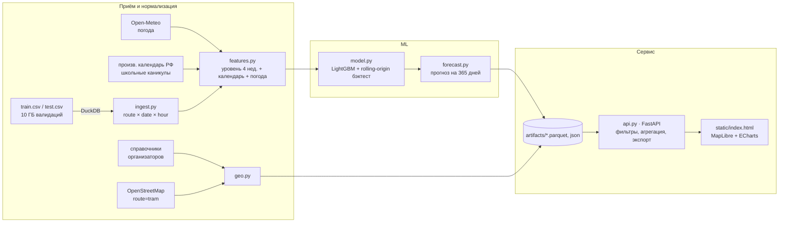

# Прогноз пассажиропотока трамваев Москвы

Хакатон Московского транспорта, трек «ИИ-прогноз загрузки трамвайных маршрутов».

Сервис прогнозирует число посадок (успешных валидаций) на 10 трамвайных маршрутах
по часам на три горизонта: день, месяц и год. Прогноз агрегируется по маршруту,
остановке и интервалу времени. Результат показывается на карте Москвы и
выгружается в CSV/XLSX.

- **Файл для проверки:** `artifacts/submission.csv` (сетка 10 маршрутов × 61 день × 24 часа = 14 640 строк, период 01.11–31.12.2025).
- **Качество в бэктесте:** WAPE-score 0.87 / 0.84 / 0.90 на трёх окнах. На окне, ближайшем к целевому (октябрь), модель превосходит наивные бейзлайны (раздел «Качество»).
- **Производительность:** на 2 vCPU / 2 ГБ сервис держит 1000 RPS при p95 = 18 мс, CPU ≈ 60 % от квоты, RAM ≈ 210 МБ (раздел «Производительность»).

## Быстрый старт (для жюри)

```bash
cp .env.example .env
make up-local          # = docker compose -f docker/docker-compose.yml --env-file .env up -d --build
# дашборд:  http://localhost:8000
# Swagger:  http://localhost:8000/docs
```

Образ самодостаточен. Внутри лежат только готовые артефакты из `artifacts/`,
поэтому датасет для запуска сервиса не нужен.

Воспроизвести весь пайплайн от сырых данных:

```bash
make install
make data        # распаковать dataset.zip → data/raw
make external    # (опционально) перекачать погоду и маршруты OSM → data/external
make pipeline    # ingest → geo → backtest → forecast  (~5 минут на 16 ядрах)
make check       # ruff + pytest
```

## Архитектура



| Модуль | Назначение |
|---|---|
| `src/tram_forecast/ingest.py` | Сырые CSV → `route_hour.parquet`: посадки, уникальные карты, отказы, число трамваев на линии. Совпадение с `labels/*` организаторов: 100 % строк |
| `src/tram_forecast/calendar.py` | Праздники и переносы (в том числе рабочая суббота 01.11.2025), школьные каникулы Москвы |
| `src/tram_forecast/features.py` | Признаки прямой многогоризонтной модели. Используется только история до точки прогноза |
| `src/tram_forecast/model.py` | Обучение, rolling-origin бэктест, абляции внешних источников |
| `src/tram_forecast/forecast.py` | Итоговый прогноз от 01.11.2025 на год, `submission.csv` |
| `src/tram_forecast/geo.py` | Остановки и геометрия маршрутов, доли остановок |
| `src/tram_forecast/api.py` | REST API; прогнозы читаются из памяти, модель в запросе не участвует |
| `src/tram_forecast/static/index.html` | Дашборд |
| `scripts/fetch_external.py` | Загрузка внешних данных |

Сервис stateless: состояние живёт в read-only артефактах внутри образа.
Поэтому горизонтальное масштабирование сводится к запуску N реплик за
балансировщиком. Новый прогноз — это новые артефакты и новый образ.

## API

| Метод | Описание |
|---|---|
| `GET /api/forecast` | Прогноз. Параметры: `horizon=day\|month\|year`, `start`, `date_from`, `date_to`, `route` (можно несколько), `stop_id`, `hour_from`, `hour_to`, `agg=hour\|day\|week\|month\|hour_of_day\|route\|total`, коэффициенты `k_weather`, `k_event`, `k_season` (0.1–3) |
| `GET /api/export?format=csv\|xlsx` | Те же параметры, выгрузка файлом |
| `GET /api/history` | Факт посадок за январь–октябрь 2025 (`date_from`, `date_to`, `route`, `agg`) |
| `GET /api/geo` | Маршруты, остановки, доли остановок |
| `GET /api/meta` | Маршруты, диапазоны дат, сезонный индекс |
| `GET /api/metrics` | Результаты бэктеста и важность признаков |
| `GET /api/health` | Проверка живости |

Примеры:

```bash
# часовой прогноз на 1 ноября по маршруту 17
curl 'localhost:8000/api/forecast?horizon=day&route=17'
# месяц по дням для маршрутов 11 и 12 с поправкой на снегопад −7 %
curl 'localhost:8000/api/forecast?horizon=month&route=11&route=12&agg=day&k_weather=0.93'
# утренний пик на остановке маршрута 1
curl 'localhost:8000/api/forecast?route=1&stop_id=2594&hour_from=7&hour_to=10'
# годовой прогноз по месяцам в Excel
curl -o year.xlsx 'localhost:8000/api/export?format=xlsx&horizon=year&agg=month'
```

Ошибки возвращаются с понятным текстом и корректным HTTP-кодом, например
`{"error": "Период вне диапазона данных: доступно 2025-11-01 … 2026-10-31"}`
(400), `{"error": "Неизвестные маршруты: [99]; ..."}` (404), `422` для
неверных типов параметров.

## Дашборд

- Горизонт (день/месяц/год), начало периода, маршруты, остановка, часы, агрегация.
- Карта Москвы: остановки окрашены по прогнозу посадок в выбранный час. Кнопка ▶ проигрывает сутки, а клик по остановке строит её график.
- График: прогноз и профиль последних 4 недель.
- KPI: сумма за период, отклонение от профиля, пиковый час, максимум посадок на один вагон в час. Последний показатель — сигнал переполнения, и по нему видно, куда добавить подвижной состав.
- Ползунки корректирующих коэффициентов (погода, событие, сезон). Прогноз, график и карта пересчитываются сразу.
- Выгрузка текущей выборки в CSV/XLSX.
- Вкладка «Качество модели»: таблица бэктеста и важность признаков.

## Данные и модель

**Целевая величина** — `boardings(route, date, hour)`, число записей с
`validation_result = 1`. Маршрут берётся из `ngpt_route`, время — из
`tran_date_time`. Пропущенные часы считаются нулями.

**Модель** — прямая многогоризонтная, одна глобальная для всех маршрутов:

1. *Уровень* — среднее посадок по маршруту × часу × типу дня (рабочий, суббота, воскресенье или праздник) за последние 4 недели обычных дней до точки прогноза. Праздники, предпраздничные дни и школьные каникулы из окна исключаются.
2. *LightGBM* предсказывает отношение `посадки / уровень` по признакам календаря (день недели, тип дня, праздник, пред- и послепраздничный день, рабочая суббота, школьные каникулы, длина праздничной серии) и погоды (температура, осадки, снег, ветер — почасовые и суточные). Функция потерь — L1 с весом, равным уровню. Это эквивалентно прямой минимизации WAPE.
3. *Итог* — `0.5 · LightGBM + 0.5 · уровень`. Бленд устойчивее каждой компоненты по отдельности.
4. Обучающая выборка — точки прогноза каждые 7 дней с 03.02.2025 и горизонт до 61 дня. Признаки `route` и `horizon` в бэктесте давали переобучение на локальные сбои маршрутов и были убраны.

Маршрут 5 в валидациях практически отсутствует: за 10 месяцев одна отклонённая
валидация 29.10.2025. В основном сабмите для него стоят нули, как разрешили организаторы.
При этом организаторы сообщили, что с нулями по маршруту 5 максимально достижимый
WAPE-score равен 0.9935. Значит, в эталоне на маршрут 5 приходится ~0.65 % посадок
(~83 тыс. за период), а в справочнике маршрут открыт с 16.12.2025. Для проверки на
лидерборде собраны два варианта с консервативным прогнозом маршрута 5 (~1000 посадок
в сутки по суммарному профилю остальных маршрутов): `submission_route5_dec16.csv`
(с 16.12) и `submission_route5_full.csv` (весь период). При L1-метрике прогноз ниже
факта уменьшает ошибку, поэтому риск ограничен.

Для горизонта «год» (2026) погода подставляется климатическая (тот же день 2025
года), а к уровню применяется месячный сезонный индекс, оценённый по будним
дням января–октября 2025. Для ноября и декабря индекс равен 1: этих месяцев нет в данных.

## Качество (rolling-origin бэктест)

Каждое окно обучается только на данных до точки прогноза. Горизонт — до 61 дня
или до конца данных. Метрика — WAPE-score = 1 − Σ|y−ŷ|/Σy.

| Точка прогноза | Итоговая модель | Профиль 4 нед. | Профиль без календаря | Наивный (прошлая неделя) |
|---|---|---|---|---|
| 2025-03-01 (март–апрель) | **0.8715** | 0.8693 | 0.8679 | 0.8635 |
| 2025-04-01 (апрель–май, майские праздники) | 0.8438 | **0.8476** | 0.8219 | 0.7835 |
| 2025-10-01 (октябрь, ближе всего к целевому периоду) | **0.9026** | 0.9004 | 0.8999 | 0.8861 |

Метрики в час пик и по суткам лежат в `artifacts/metrics.json` и во вкладке «Качество модели».
Суточная точность итоговой модели в октябре — 0.944.

Потолок точности. Если профиль посчитать по самому прогнозируемому периоду
(«подглядывание»), WAPE-score на сентябре–октябре равен 0.92–0.94. Это
почасовой шум, который модель на уровне маршрута в принципе не снимет.
Остальная ошибка — сдвиги уровня: ремонты и изменения маршрутов, например
маршрута 7 в июле–августе, и переходы лето → осень.

## Калибровка по лидерборду

Организаторы подтвердили, что скрытой части у лидерборда нет: скор считается по
всему ноябрю–декабрю. Поэтому поверх модели сделана калибровка пробными посылками
(`scripts/probe.py`, журнал скоров — `artifacts/probes*/scores.json`).

- Скор равен 1 − E/S. Проба умножает прогноз одной группы ячеек на 1.05, и по сдвигу скора восстанавливается истинный уровень группы. Остатки берутся из октябрьского бэктеста, после чего подбирается оптимальный множитель группы. На симуляции метод находит уровень с точностью ±0.01.
- Разница скоров вариантов маршрута 5 даёт сумму эталона S ≈ 12.87 млн посадок. Там же видно, что маршрут 5 в эталоне равен нулю до 16.12 и набирает ≈ 83.6 тыс. посадок после. Оптимальный уровень — ≈ 5500 посадок в сутки с 17.12.
- Группы раунда 1: 1 ноября, будни и выходные ноября, 1–26 декабря, 27–31 декабря, каждый маршрут.

| Посылка | WAPE-score |
|---|---|
| Модель, маршрут 5 = 0 (`submission.csv`) | 0.88036 |
| + маршрут 5 с 16.12, 1000/сутки | 0.88146 |
| + маршрут 5 с 17.12, 5000/сутки | 0.88496 |
| Калибровка раунда 1 (`submission_calibrated_v1.csv`) | **0.88804** |

Раунд 2 (`artifacts/probes2/`) проверяет форму суточного профиля, понедельники и
пятницы и уровни отдельных недель.

## Внешние источники и подтверждение эффекта

| Источник | Как получить | Эффект в бэктесте |
|---|---|---|
| Производственный календарь РФ 2025/2026 (праздники, переносы, рабочая суббота 01.11) | https://www.consultant.ru/law/ref/calendar/proizvodstvennye/2025/ , `src/tram_forecast/calendar.py` | Профиль с типом дня против профиля по дню недели: **+0.026** WAPE-score на окне с майскими праздниками (0.8476 против 0.8219) |
| Школьные каникулы Москвы | https://1517.mskobr.ru/edu-news/11020 , https://www.mos.ru/city/projects/kanikuly/ | Исключение каникул из окна уровня. Признак `school_break` — второй по важности (gain) |
| Погода Москвы, почасовая (Open-Meteo, ERA5) | https://archive-api.open-meteo.com/v1/archive?latitude=55.75&longitude=37.62&start_date=2025-01-01&end_date=2025-12-31&hourly=temperature_2m,precipitation,snowfall,snow_depth,wind_speed_10m,cloud_cover&timezone=Europe/Moscow , файл `data/external/weather_moscow_2025.csv` | Абляция «без погоды»: +0.003 на апрельском окне, +0.0005 на октябрьском, −0.004 на мартовском. Эффект положительный, но слабый и нестабильный. Для ноября–декабря со снегопадами ожидается сильнее |
| Маршруты и остановки OpenStreetMap | https://overpass.private.coffee/api/interpreter (`relation[route=tram]`), `scripts/fetch_external.py` | Геометрия путей на карте и остановки маршрутов, которых нет в справочнике |

По условиям организаторов допускаются внешние данные, опубликованные после
31.10.2025. Поэтому для ноября–декабря 2025 используется фактическая погода из
архива. Для эксплуатации вместо архива подставляется прогноз:
https://api.open-meteo.com/v1/forecast.

Трафик и события в модель не входят. Их учёт в интерфейсе — коэффициент
«Событие». Путь к автоматизации описан в плане развития.

## Область применимости

**Область определения.** Модель валидна:

- для 9 маршрутов с историей (1, 7, 11, 12, 17, 25, 26, 28, 50) на уровне маршрут × час;
- на горизонте до ~2 месяцев от конца истории: здесь бэктест даёт 0.84–0.90;
- в режимах, которые были в обучении: будни, выходные, одиночные праздники и длинные праздничные серии (Новый год, май), школьные каникулы, температура от −20 до +30 °C.

Прогноз по остановке — это **оценка**: прогноз маршрута × доля остановки.
Доля считается по эвристике: пересадочные узлы (метро, МЦК, вокзалы) и
конечные весят больше. В валидациях нет остановки, телематики нет, поэтому
точность на уровне остановки не проверяема. Остановки с координатами есть в
справочнике для маршрутов 1, 5, 7, 11, 12, для остальных маршрутов они берутся из OSM.

Горизонт «год» — качественный сценарий. Сезонность ноября и декабря в данных
не наблюдалась, а индекс января–октября оценён по одному году.

**Область адаптации.** Что нужно для переноса:

- *Новый период:* пересчитать `make pipeline` на свежих валидациях. Уровень обновляется автоматически, переобучение занимает ~1 минуту.
- *Новый маршрут:* нужно ≥ 4 недель валидаций. Модель глобальная, признака маршрута нет, поэтому она переносится без изменений. Для карты нужен справочник остановок или relation в OSM.
- *Изменение сети* (ремонт, продление, закрытие) проявится в уровне через 1–2 недели. До этого поправка вводится коэффициентом «Событие».
- *Внешние данные:* погода — Open-Meteo. Календарь следующего года нужно дописать в `calendar.py` (2026 год уже внесён).

## Корректирующие коэффициенты

`k_weather`, `k_event`, `k_season` в API и ползунки в интерфейсе. Они умножают
прогноз выбранной выборки: маршрута, остановки, периода, часов. Результат
виден сразу на графике, KPI и карте, а выгрузка учитывает коэффициенты. Ориентиры:

- сильный снегопад: −5…−10 %;
- массовое мероприятие у линии: +10…+30 %;
- предновогодняя неделя: −5…−10 %.

## Производительность

Замеры сделаны на рабочей станции (16 ядер, Docker 29.7) с помощью `hey`
(`scripts/loadtest.sh`, `make loadtest`). Контейнер ограничен
`--cpus`/`--memory`, uvicorn запущен с воркерами по числу vCPU,
`POLARS_MAX_THREADS=1`.

**Фиксированная нагрузка, 2 vCPU / 2 ГБ, 2 воркера**, запрос месячного прогноза по 2 маршрутам (агрегация по дням):

| Нагрузка | p50 | p95 | p99 | CPU контейнера | RAM | Ошибки |
|---|---|---|---|---|---|---|
| 500 RPS, 30 с | 16 мс | 20 мс | 34 мс | 59 % из 200 % (≈30 % квоты) | 209 МБ | 0 |
| 1000 RPS, 30 с | 16 мс | 18 мс | 32 мс | 120 % из 200 % (≈60 % квоты) | 211 МБ | 0 |

**Предельная пропускная способность** (50 соединений, 15 с, CPU 100 % квоты):

| Запрос | 2 vCPU: RPS / p95 | 4 vCPU: RPS / p95 |
|---|---|---|
| День, маршрут 17, по часам | 1574 / 64 мс | 2697 / 53 мс |
| Месяц, 2 маршрута, по дням, с коэффициентом | 1612 / 71 мс | 2884 / 51 мс |
| Год, все маршруты, по месяцам (87 600 строк в агрегации) | 577 / 111 мс | 949 / 88 мс |
| День, остановка, часы 7–10 | 1653 / 69 мс | 2821 / 53 мс |
| Экспорт CSV, месяц по дням | 726 / 83 мс | 1148 / 62 мс |

RAM стабильна: 210–250 МБ на 2 воркерах и ~410 МБ на 4 воркерах под
нагрузкой, без роста и без swap. Запрос не трогает модель: все прогнозы на год
(87 600 строк) лежат в памяти как polars DataFrame, и выполняются только
фильтр и group-by.

## Бизнес-ценность

- **Распределение подвижного состава.** Прогноз посадок на вагон в час показывает маршруты и часы, где вагоны переполнены (утренний пик на №17 — ~220 посадок на вагон в час) или недогружены (вечер выходных). Выпуск можно перераспределять между маршрутами одного депо.
- **Расписание.** Часовой профиль по типу дня (будни, суббота, праздник, рабочая суббота) — готовый вход для расчёта интервалов движения на месяц вперёд.
- **Праздники и каникулы.** Спрос в праздники падает примерно вдвое, на школьных каникулах — заметно. Прогноз заранее показывает дни, когда выпуск можно сократить.
- **Стратегия.** Годовой сценарий с сезонным индексом даёт оценку для планирования ремонтов и летнего сокращения выпуска: в июле–августе спрос ~80 % от октября.

## Ограничения и план развития

Ограничения:

- В данных только 10 месяцев одного года. Сезонность ноября–декабря не наблюдалась, праздничный эффект Нового года известен только по январю.
- Посадки — это валидации. Безбилетный проезд и пересадки без повторной валидации не видны.
- Остановочная детализация — эвристика: нет привязки валидации к остановке и нет телематики.
- Ремонты и изменения маршрутов не предсказываются, пока не отразятся в данных.

План развития:

1. Телематика ТС → привязка валидации к остановке (`merge_asof` по времени + ближайшая остановка) → настоящий прогноз по остановкам и перегонам, загрузка вагона через trip chaining по `crd_hashcode`.
2. Автоматический учёт событий (афиша мосгорспорта и концертных площадок) и перекрытий (открытые данные Дептранса) как признаков.
3. Данные о дорожной ситуации (индекс пробок) как признак для маршрутов на общих полосах.
4. Ежедневное переобучение по расписанию и прогноз погоды Open-Meteo вместо архива. Приём потоковых валидаций в ClickHouse.
5. Больше лет истории для настоящей годовой сезонности.

## Структура репозитория

```
artifacts/      готовые прогнозы, метрики, модель, submission.csv, geo.json
data/external/  погода Open-Meteo (и OSM после make external)
docker/         Dockerfile, docker-compose.yml
scripts/        загрузка внешних данных, нагрузочный тест
src/tram_forecast/  пайплайн, модель, API, дашборд
tests/          pytest
```
